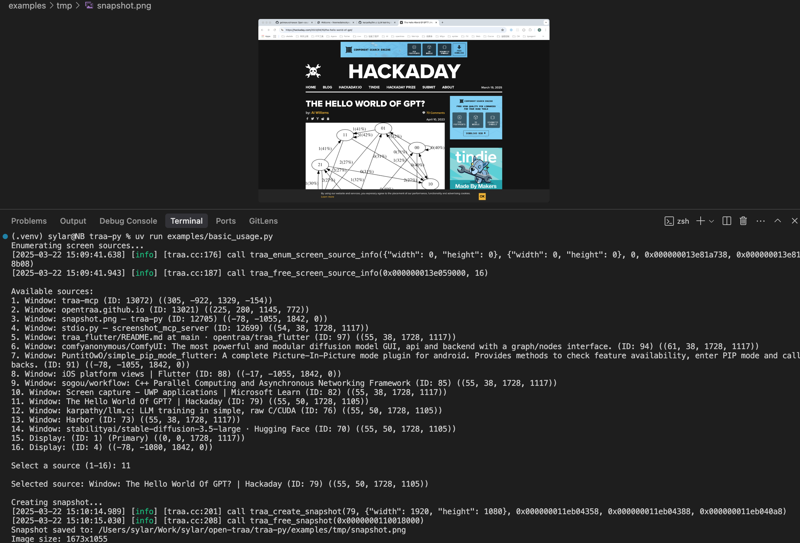
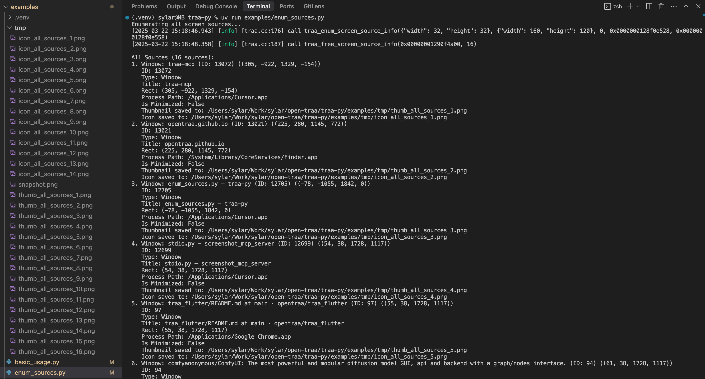

# TRAA Python Bindings

Python bindings for the TRAA (To Record Anything Anywhere) library - a high-performance, cross-platform solution for screen capture, window enumeration, and desktop recording. Supports Windows, macOS, and Linux with a clean, Pythonic API.

## Features

- Screen and window enumeration with filtering options
- High-performance screen capture
- Support for multiple displays and windows
- Thumbnail and icon capture
- Cross-platform compatibility (Windows, macOS, Linux)

## Installation

```bash
pip install traa
```

## Quick Start

```python
from traa import Size, ScreenSourceFlags, enum_screen_sources, create_snapshot
from PIL import Image

# Enumerate screen sources
sources = enum_screen_sources(
    thumbnail_size=Size(160, 120),  # Optional: Get thumbnails
    icon_size=Size(32, 32),        # Optional: Get icons
    external_flags=ScreenSourceFlags.NONE  # Use default enumeration behavior
)

# Print available sources
for source in sources:
    print(f"Found source: {source}")
    
    # Save thumbnail if available
    if source.thumbnail_data is not None:
        Image.fromarray(source.thumbnail_data).save(f"thumb_{source.id}.png")
    
    # Save icon if available
    if source.icon_data is not None:
        Image.fromarray(source.icon_data).save(f"icon_{source.id}.png")

# Capture from the first source
if sources:
    # Capture at Full HD resolution
    image, actual_size = create_snapshot(sources[0].id, Size(1920, 1080))
    
    # Determine image mode based on shape
    mode = "RGB" if len(image.shape) == 3 and image.shape[2] == 3 else \
           "RGBA" if len(image.shape) == 3 and image.shape[2] == 4 else "L"
    
    # Save the snapshot
    Image.fromarray(image, mode=mode).save("snapshot.png")
    print(f"Captured image size: {actual_size}")
```

## API Reference

### Functions

#### `enum_screen_sources(icon_size: Optional[Size] = None, thumbnail_size: Optional[Size] = None, external_flags: ScreenSourceFlags = ScreenSourceFlags.NONE) -> List[ScreenSourceInfo]`

Enumerates available screen sources (displays and windows).

- `icon_size`: Optional size for source icons
- `thumbnail_size`: Optional size for source thumbnails
- `external_flags`: Flags to control enumeration behavior
- Returns: List of `ScreenSourceInfo` objects

Example:
```python
# Get only non-minimized windows with thumbnails
sources = enum_screen_sources(
    thumbnail_size=Size(160, 120),
    external_flags=ScreenSourceFlags.IGNORE_SCREEN | ScreenSourceFlags.IGNORE_MINIMIZED
)
```

#### `create_snapshot(source_id: int, size: Size) -> Tuple[np.ndarray, Size]`

Creates a snapshot of the specified screen source.

- `source_id`: ID of the source to capture
- `size`: Requested size of the snapshot
- Returns: Tuple of (image data as numpy array, actual capture size)

Example:
```python
# Capture a window at 4K resolution
image, size = create_snapshot(window_id, Size(3840, 2160))
Image.fromarray(image, mode="RGB").save("4k_snapshot.png")
```

### Classes

#### `Size`

Represents a size with width and height.

```python
# Create a Full HD size
size = Size(width=1920, height=1080)
print(size)  # "1920x1080"

# Create a 4K UHD size
size_4k = Size(3840, 2160)
```

#### `Rect`

Represents a rectangle with left, top, right, and bottom coordinates.

```python
# Create a rectangle
rect = Rect(left=0, top=0, right=1920, bottom=1080)
print(rect)  # "(0, 0, 1920, 1080)"
print(rect.width)  # 1920
print(rect.height)  # 1080
```

#### `ScreenSourceInfo`

Contains information about a screen source.

Properties:
- `id`: Unique identifier
- `is_window`: Whether this is a window or display
- `rect`: Source rectangle
- `title`: Source title
- `process_path`: Process path (windows only)
- `is_minimized`: Window minimized state
- `is_maximized`: Window maximized state
- `is_primary`: Whether this is the primary display
- `icon_data`: Optional icon image data (numpy array)
- `thumbnail_data`: Optional thumbnail image data (numpy array)

Example:
```python
# Print detailed information about a source
def print_source_info(source):
    print(f"Source: {source.title}")
    print(f"Type: {'Window' if source.is_window else 'Display'}")
    print(f"Rectangle: {source.rect}")
    if source.is_window:
        print(f"Process: {source.process_path}")
        print(f"Minimized: {source.is_minimized}")
    else:
        print(f"Primary Display: {source.is_primary}")
```

#### `ScreenSourceFlags`

Enumeration flags for controlling screen source enumeration behavior.

```python
class ScreenSourceFlags(IntFlag):
    NONE = 0                        # Default behavior
    IGNORE_SCREEN = 1 << 0          # Ignore display screens
    IGNORE_WINDOW = 1 << 1          # Ignore windows
    IGNORE_MINIMIZED = 1 << 2       # Ignore minimized windows
    NOT_IGNORE_UNTITLED = 1 << 3    # Include untitled windows
    NOT_IGNORE_UNRESPONSIVE = 1 << 4  # Include unresponsive windows
    IGNORE_CURRENT_PROCESS_WINDOWS = 1 << 5  # Ignore windows from current process
    NOT_IGNORE_TOOLWINDOW = 1 << 6  # Include tool windows
    IGNORE_NOPROCESS_PATH = 1 << 7  # Ignore windows without process path
    NOT_SKIP_SYSTEM_WINDOWS = 1 << 8  # Include system windows
    NOT_SKIP_ZERO_LAYER_WINDOWS = 1 << 9  # Include zero layer windows
    ALL = 0xFFFFFFFF                # All flags enabled
```

Common flag combinations:
```python
# Get only displays (no windows)
displays = enum_screen_sources(
    external_flags=ScreenSourceFlags.IGNORE_WINDOW
)

# Get only active windows (no displays, no minimized)
active_windows = enum_screen_sources(
    external_flags=ScreenSourceFlags.IGNORE_SCREEN | 
                  ScreenSourceFlags.IGNORE_MINIMIZED
)

# Get all sources including system windows
all_sources = enum_screen_sources(
    external_flags=ScreenSourceFlags.NOT_SKIP_SYSTEM_WINDOWS | 
                  ScreenSourceFlags.NOT_IGNORE_TOOLWINDOW
)
```

## Examples

See the `examples` directory for more detailed examples:

- `basic_usage.py`: Demonstrates basic screen capture functionality
  - Enumerating screen sources
  - Selecting a source interactively
  - Capturing and saving screenshots



- `enum_sources.py`: Shows advanced source enumeration with filtering
  - Using different flag combinations
  - Getting thumbnails and icons
  - Displaying detailed source information
  - Filtering sources by type and state


## Requirements

- Python 3.7+
- NumPy for array operations
